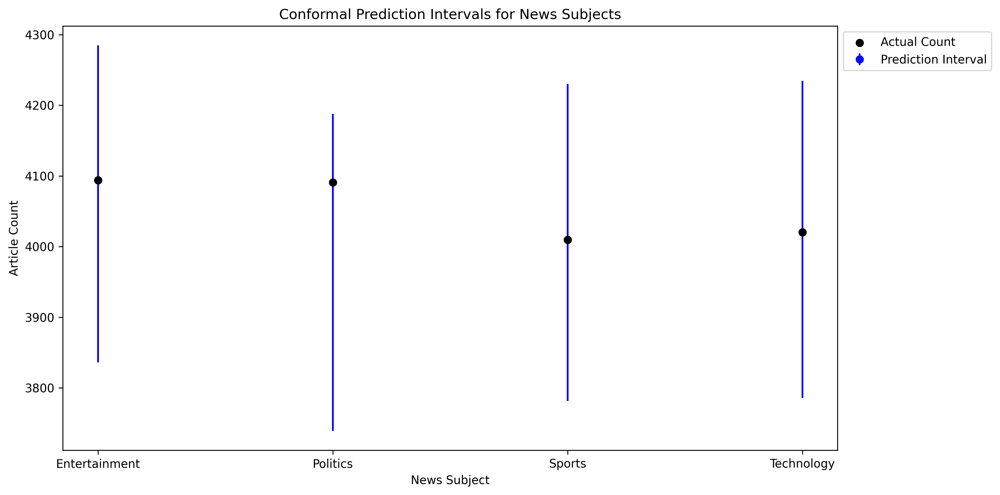

```{r setup, include=FALSE}
knitr::opts_chunk$set(echo = TRUE)
```


# Introduction

Statistical inference methods play a critical role in data science. Traditional approaches, such as frequentist and Bayesian inference, offer probabilistic reasoning frameworks but come with certain limitations. This project explores **Conformal Prediction (CP)** as a scalable alternative to Bayesian uncertainty quantification. CP constructs **valid prediction intervals** with finite-sample guarantees without requiring prior distributions.

# Frequentist vs. Bayesian Approaches

## Frequentist Approach
- Parameters are fixed but unknown.
- Statistical inference is based on repeated sampling.
- Confidence intervals estimate the range of parameter values.

## Bayesian Approach
- Uses **Bayes' Theorem** to update prior beliefs into a posterior distribution.
- Requires subjective prior selection.
- Computationally expensive, especially in high dimensions (e.g., MCMC sampling).

## Limitations of Bayesian Inference
1. **Subjectivity in prior selection**
2. **Computational complexity** (costly MCMC calculations)
3. **Scalability issues** in large datasets

# Conformal Prediction: An Alternative

Conformal Prediction (CP) provides a **distribution-free** method to construct valid prediction intervals.

## How CP Works
- CP does not estimate a full probability distribution.
- Uses **nonconformity scores** to measure deviation from past observations.
- Constructs **prediction sets** based on empirical quantiles.

### Comparison of Bayesian and Conformal Prediction

| Feature           | Bayesian Inference    | Conformal Prediction |
|------------------|----------------------|----------------------|
| Prior Knowledge  | Required             | Not Needed          |
| Uncertainty Estimation | Posterior Distributions | Prediction Sets |
| Computational Cost | High (MCMC)         | Efficient (Quantile-based) |
| Scalability      | Limited for Big Data  | Highly Scalable     |

# Applications of Conformal Prediction

CP is widely applicable in multiple domains:

- **Healthcare**: Uncertainty-aware diagnostics
- **Finance**: Risk assessment in stock markets
- **Cybersecurity**: Anomaly detection in network traffic
- **News Forecasting**: This project applies CP to forecast news article counts across four categories: _Entertainment, Politics, Sports, Technology._

# Implementation Details

## Algorithmic Steps
1. Train a **base model** (linear regression).
2. Compute **residuals** (nonconformity scores).
3. Estimate **thresholds** using empirical quantiles.
4. Construct **prediction intervals** ensuring coverage probability.

Execution Time Summary:
```r
# Summary from execution log
training_time <- 0.1021  # seconds
prediction_time <- 0.0058  # seconds
total_run_time <- 0.1079  # seconds
```

# Computational Complexity

| CP Method   | Complexity  | Pros | Cons |
|------------|------------|------|------|
| **Inductive CP (ICP)** | O(n) | Fast, scalable | Intervals may be wide |
| **Transductive CP (TCP)** | O(nk) | Tighter intervals | Computationally expensive |
| **Mondrian CP** | O(n log n) | Efficient and adaptive | Assumes conditional independence |

ICP was selected due to its **efficiency and scalability**.

# Results and Visualization

Below is the visual representation of Conformal Prediction intervals applied to news article forecasting:

```{r results_plot, fig.width=8, fig.height=6, out.width="100%"}
if (file.exists("COMP_4581_Project_Plot.png")) {
  
} else {
  cat("Warning: Image file 'COMP_4581_Project_Plot.png' not found. Skipping visualization.")
}
```

# Future Considerations

To enhance Conformal Prediction, future research should explore:

1. **Adaptive nonconformity scores** to refine prediction intervals.
2. **Comparative evaluation with Bayesian inference** for deeper insights.
3. **Parallel processing techniques** for large-scale CP applications.

# Conclusion

Conformal Prediction provides **valid prediction intervals** without relying on Bayesian priors. It is computationally efficient and scalable for **real-world applications** such as **finance, healthcare, and cybersecurity**. Future research should focus on improving interval tightness and extending CP methods to deep learning frameworks.
